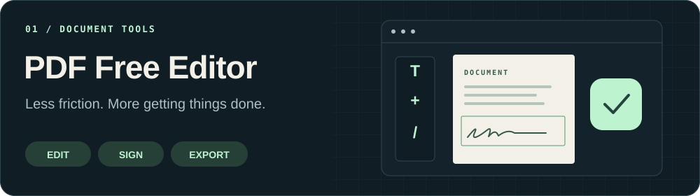
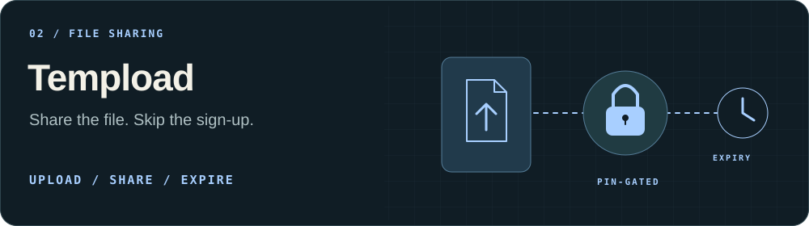
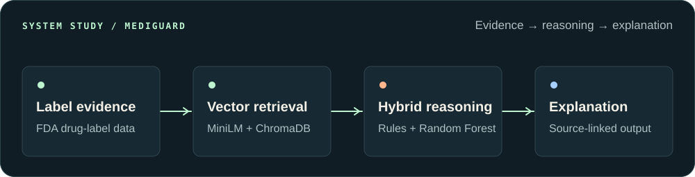
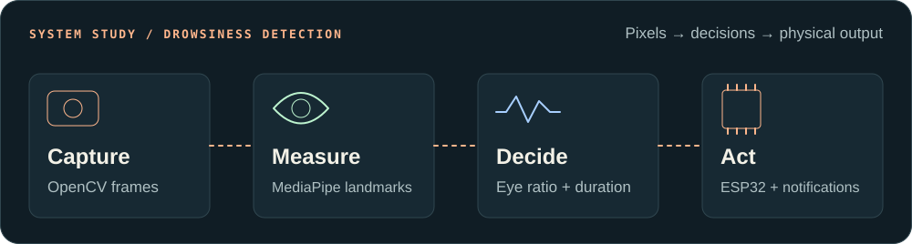

<picture>
  <source media="(max-width: 600px)" srcset="./assets/hero-mobile.svg">
  
</picture>

  <a href="#products"><b>Products</b></a> &nbsp; / &nbsp;
  <a href="#engineering"><b>Engineering</b></a> &nbsp; / &nbsp;
  <a href="#toolkit"><b>Toolkit</b></a> &nbsp; / &nbsp;
  <a href="https://github.com/MaazSohail11?tab=repositories"><b>All repositories ↗</b></a>

## Good software earns its place in someone's day.

I'm **Maaz**, a Computer Engineering student who likes taking a problem all the way from the first sketch to a working system. I build browser tools, AI applications, and connected hardware—with a particular interest in privacy, useful automation, and interfaces that make complex things feel simple.

My work spans **document editing, temporary file sharing, explainable AI, computer vision, and database-backed applications**. I care about how the parts fit together: the interface, the processing, the data, and the person using the result.

## 01 / Products you can use

### [PDF Free Editor ↗](https://pdffreeeditor.com)

<a href="https://pdffreeeditor.com"><picture>
  <source media="(max-width: 600px)" srcset="./assets/pdf-editor-mobile.svg">
  
</picture></a>

**Everyday document work, with less friction.** A browser-based toolkit for editing, signing, merging, splitting, compressing, and converting PDFs. Core editing happens on the device by default, without requiring an account or adding a watermark.

**Engineering focus:** document workflows, client-side processing, and a clear path from opening a file to exporting the result.

[Open the editor](https://pdffreeeditor.com) · [Explore the documentation](https://github.com/MaazSohail11/pdffreeeditor-docs)

### [Tempload ↗](https://tempload.app)

<a href="https://tempload.app"><picture>
  <source media="(max-width: 600px)" srcset="./assets/tempload-mobile.svg">
  
</picture></a>

**A file handoff, without another account.** Temporary file sharing with PIN-gated downloads, automatic expiry, QR sharing, and in-browser ZIP packaging for multiple files.

**Engineering focus:** a React and Vite interface connected to a Cloudflare Workers API and R2 storage, with multipart uploads for larger payloads.

[Try Tempload](https://tempload.app) · [Read the source](https://github.com/MaazSohail11/Tempload)

## 02 / Under the hood

The interesting part is connecting an idea to a complete workflow. Two projects that show how I approach that:

### MediGuard · Explainable AI

<picture>
  <source media="(max-width: 600px)" srcset="./assets/mediguard-mobile.svg">
  
</picture>

A local medication-safety research prototype that turns drug-label text into structured, traceable insights. It combines **MiniLM embeddings and ChromaDB retrieval**, **forward-chaining rules**, and a **Random Forest classifier** inside a Streamlit application.

The output connects its risk assessment to retrieved evidence and triggered rules. Explanations use deterministic templates, making the decision path inspectable.

**What this demonstrates:** data preprocessing, vector search, hybrid reasoning, and an interface that exposes the evidence behind a result.

[Explore MediGuard's architecture and source ↗](https://github.com/MaazSohail11/MediGuard-AI-Drug-Label-Safety-Agent)

### Drowsiness Detection · Vision meets hardware

<picture>
  <source media="(max-width: 600px)" srcset="./assets/drowsiness-mobile.svg">
  
</picture>

A real-time prototype that connects **OpenCV and MediaPipe eye tracking** to an **ESP32 hardware buzzer**. Eye-aspect-ratio measurements and a duration threshold distinguish sustained eye closure from short blinks, with local audio and WhatsApp notifications alongside the hardware alert.

**What this demonstrates:** frame processing, time-based decision logic, HTTP communication with a microcontroller, and coordination between software and physical outputs.

[Explore the detection pipeline and hardware setup ↗](https://github.com/MaazSohail11/Drowsiness-Detection-System-with-ESP32)

### More from the workbench

| Project | What I built and explored |
| :--- | :--- |
| **[Figma Screen Generator](https://github.com/MaazSohail11/Figma-Screen-generator)** | Programmatic mobile and desktop UI generation with JavaScript and the Figma Plugin API. Shared design tokens and element naming connect wireframes to higher-fidelity screens. |
| **[TechRex Cloud](https://github.com/MaazSohail11/multi-user-cloud-storage)** | A self-hosted Flask file server with separate user storage, browser-based file management, and configurable sharing. A practical exploration of authentication and local-network workflows. |
| **[SheSells Marketplace](https://github.com/MaazSohail11/Ecommerce-Marketplace-Database-Project)** | A PHP and MySQL database project connecting customer, seller, and admin workflows. Relational modeling, normalized carts and orders, and transactional checkout. |
| **[PixelForge](https://github.com/MaazSohail11/PixelForge-DSP-Photo-Editor)** | A desktop photo editor with NumPy-based convolution, custom filter kernels, and point operations. Image-processing fundamentals connected to an interactive Python interface. |

## 03 / Tools, with a purpose

| Area | My working toolkit |
| :--- | :--- |
| **Interfaces & applications** | JavaScript, React, Vite, HTML, CSS, Python, Flask, PHP |
| **AI & data** | ChromaDB, MiniLM embeddings, scikit-learn, Streamlit, NumPy, MySQL |
| **Vision & hardware** | OpenCV, MediaPipe, ESP32, Arduino, HTTP over Wi-Fi |
| **Delivery & design** | Git, GitHub, Cloudflare Workers, R2, Figma Plugin API |

## 04 / How I build

**Understand the workflow.** Start with the actual task: who needs this, what gets in their way, and what a useful result looks like.

**Connect the whole system.** Make the interface, logic, data, and outputs work together. Think through the awkward inputs and the next person who has to use it.

**Refine and document.** Remove unnecessary steps, make the behavior understandable, and write down how to run and extend the project.

---

**Currently exploring:** AI-assisted workflows, practical automation, and the boundary between software and physical systems.

Interested in how something works? Start with a repository—the architecture, implementation, and setup notes are part of the work.

**[Browse my repositories ↗](https://github.com/MaazSohail11?tab=repositories)** &nbsp; · &nbsp; **[PDF Free Editor ↗](https://pdffreeeditor.com)** &nbsp; · &nbsp; **[Tempload ↗](https://tempload.app)**

