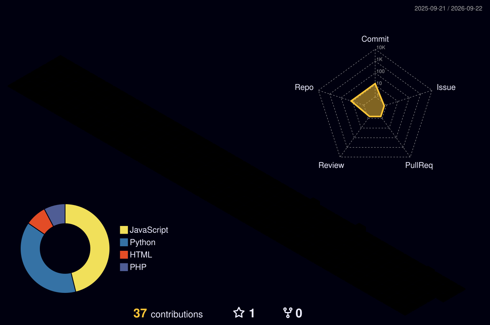

<div align="center">

<!-- ═══════════════════════════════════════════════════════════════════════ -->
<!--                        🌊 ANIMATED HEADER                            -->
<!-- ═══════════════════════════════════════════════════════════════════════ -->


<br/>

<!-- ═══════════════════════════════════════════════════════════════════════ -->
<!--                       ⌨️ TYPING ANIMATION                            -->
<!-- ═══════════════════════════════════════════════════════════════════════ -->

<a href="https://git.io/typing-svg"></a>

<br/>

<!-- ═══════════════════════════════════════════════════════════════════════ -->
<!--                        🔗 SOCIAL BADGES                              -->
<!-- ═══════════════════════════════════════════════════════════════════════ -->

<a href="https://github.com/MaazSohail11">
  
</a>
&nbsp;
<a href="https://pdffreeeditor.com">
  
</a>
&nbsp;
<a href="https://tempload.app">
  
</a>

<br/><br/>

<a href="https://pdffreeeditor.com">
  
</a>
&nbsp;


</div>

<!-- ═══════════════════════════════════════════════════════════════════════ -->
<!--                        ✨ DIVIDER                                     -->
<!-- ═══════════════════════════════════════════════════════════════════════ -->


<div align="center">

```
⚡ "software is only impressive when it survives real use" ⚡
```

> _I build systems that connect ideas, interfaces, data, automation, and real workflows._
> _Computer Engineering student turning rough ideas into working systems._

</div>


<!-- ═══════════════════════════════════════════════════════════════════════ -->
<!--                   📊 PROFILE SUMMARY CARDS                            -->
<!-- ═══════════════════════════════════════════════════════════════════════ -->

<div align="center">

##  &nbsp;Profile Insights

<br/>


<br/>


&nbsp;&nbsp;


<br/>


&nbsp;&nbsp;


</div>


<!-- ═══════════════════════════════════════════════════════════════════════ -->
<!--                      📡 SIGNAL / EXPERTISE                           -->
<!-- ═══════════════════════════════════════════════════════════════════════ -->

<div align="center">

##  &nbsp;Signal

</div>

<table align="center">
<tr>
<td width="25%" align="center">

### 🧠 AI
<br/>

`RAG Systems`
`ML Pipelines`
`Local Reasoning`
`AI Agents`
`Rule Engines`

</td>
<td width="25%" align="center">

### ⚙️ Systems
<br/>

`Flask / Vite`
`React / PHP`
`MySQL / APIs`
`Streamlit`
`Cloudflare`

</td>
<td width="25%" align="center">

### 🔌 Hardware
<br/>

`ESP32`
`Sensors & Alerts`
`Real-time Loops`
`IoT Pipelines`
`Edge Computing`

</td>
<td width="25%" align="center">

### 🚀 Product
<br/>

`Privacy-First`
`UX Design`
`Documentation`
`Shipping Fast`
`User Research`

</td>
</tr>
</table>


<!-- ═══════════════════════════════════════════════════════════════════════ -->
<!--                       🎯 CURRENT SHAPE                               -->
<!-- ═══════════════════════════════════════════════════════════════════════ -->

<div align="center">

##  &nbsp;Current Shape

</div>

<div align="center">

```
🎯 focus        →  practical systems, product tools, automation, AI-assisted workflows
🔧 style        →  build first, understand deeply, document clearly
🌐 range        →  web apps, AI agents, IoT, databases, image processing, UI automation
🧭 direction    →  becoming the kind of engineer who can own messy real-world problems
```

</div>


<!-- ═══════════════════════════════════════════════════════════════════════ -->
<!--                        🗺️ WORK MAP                                   -->
<!-- ═══════════════════════════════════════════════════════════════════════ -->

<div align="center">

##  &nbsp;Work Map

<br/>

<a href="https://github.com/MaazSohail11/MediGuard-AI-Drug-Label-Safety-Agent">
  
</a>
&nbsp;&nbsp;
<a href="https://github.com/MaazSohail11/Drowsiness-Detection-System-with-ESP32">
  
</a>

<a href="https://github.com/MaazSohail11/Figma-Screen-generator">
  
</a>
&nbsp;&nbsp;
<a href="https://github.com/MaazSohail11/multi-user-cloud-storage">
  
</a>

<a href="https://github.com/MaazSohail11/Ecommerce-Marketplace-Database-Project">
  
</a>
&nbsp;&nbsp;
<a href="https://github.com/MaazSohail11/PixelForge-DSP-Photo-Editor">
  
</a>

</div>


<!-- ═══════════════════════════════════════════════════════════════════════ -->
<!--                      🛠️ TECH STACK                                    -->
<!-- ═══════════════════════════════════════════════════════════════════════ -->

<div align="center">

##  &nbsp;Tech Arsenal

<br/>

### 🔤 Languages


<br/><br/>

### 🏗️ Frameworks & Tools


<br/><br/>

### ☁️ Cloud & DevOps


<br/><br/>

### 🎨 Design & Hardware


<br/><br/>


</div>


<!-- ═══════════════════════════════════════════════════════════════════════ -->
<!--                      📊 GITHUB STATS                                  -->
<!-- ═══════════════════════════════════════════════════════════════════════ -->

<div align="center">

##  &nbsp;GitHub Analytics

<br/>


&nbsp;&nbsp;


<br/><br/>


<br/><br/>


</div>


<!-- ═══════════════════════════════════════════════════════════════════════ -->
<!--                🏙️ 3D CONTRIBUTION SKYLINE                             -->
<!-- ═══════════════════════════════════════════════════════════════════════ -->

<div align="center">

## 🏙️ 3D Contribution Skyline

<br/>

<picture>
  <source media="(prefers-color-scheme: dark)" srcset="./profile-3d-contrib/profile-night-rainbow.svg" />
  <source media="(prefers-color-scheme: light)" srcset="./profile-3d-contrib/profile-south-season-animate.svg" />
  
</picture>

</div>


<!-- ═══════════════════════════════════════════════════════════════════════ -->
<!--                      🧩 BUILD PATTERN                                 -->
<!-- ═══════════════════════════════════════════════════════════════════════ -->

<div align="center">

##  &nbsp;Build Pattern

</div>

<table align="center">
<tr>
<td width="33%" align="center">

### 🔍 01 — Understand
<br/>

_Understand the workflow_
_before touching the UI._

> Think first. Build second.

</td>
<td width="33%" align="center">

### ⚡ 02 — Ship
<br/>

_Make the system work_
_end-to-end before polishing._

> Working beats perfect.

</td>
<td width="33%" align="center">

### 📝 03 — Document
<br/>

_Document it like someone else_
_has to run it tomorrow._

> Future-proof everything.

</td>
</tr>
</table>


<!-- ═══════════════════════════════════════════════════════════════════════ -->
<!--                      📝 SMALL NOTES                                   -->
<!-- ═══════════════════════════════════════════════════════════════════════ -->

<details>
<summary><b>💭 small notes</b></summary>

<br/>

<div align="center">

```
 ╔══════════════════════════════════════════════════════════════╗
 ║                                                              ║
 ║   I care about:                                              ║
 ║                                                              ║
 ║   🔹 simple products that solve boring but real problems     ║
 ║   🔹 readable repositories                                  ║
 ║   🔹 systems that connect frontend, backend, data & users   ║
 ║   🔹 privacy-first tools                                    ║
 ║   🔹 learning fast enough to stay useful                    ║
 ║                                                              ║
 ╚══════════════════════════════════════════════════════════════╝
```

</div>

</details>

<!-- ═══════════════════════════════════════════════════════════════════════ -->
<!--                        🎬 FOOTER                                      -->
<!-- ═══════════════════════════════════════════════════════════════════════ -->

<br/>

<div align="center">


<br/><br/>


</div>
